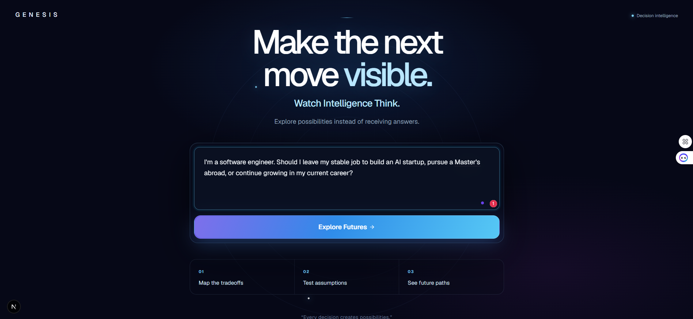
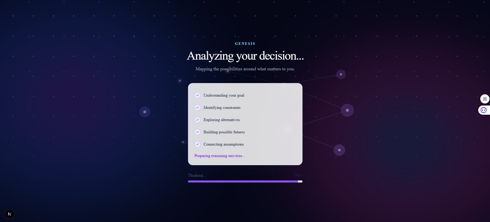
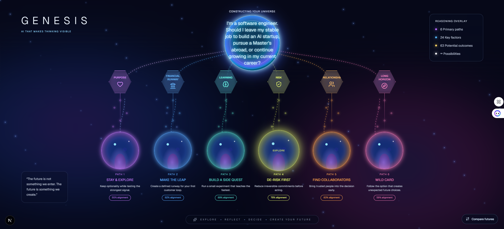
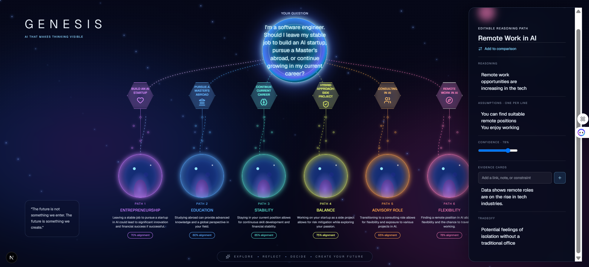

<div align="center">
  <br />
  <h1>✦ GENESIS</h1>
  <p><strong>AI That Makes Thinking Visible</strong></p>
  <p><em>Explore possibilities instead of receiving answers.</em></p>
  <br />
</div>

<p align="center">
  
  
  
  
  
  
  
  
</p>

---

## 📋 Table of Contents

- [Why Genesis?](#-why-genesis)
- [How It Works](#-how-it-works)
- [User Flow](#-user-flow)
- [Features](#-features)
- [Tech Stack](#-tech-stack)
- [Architecture](#-architecture)
- [Project Structure](#-project-structure)
- [Getting Started](#-getting-started)
- [Environment Variables](#-environment-variables)
- [Usage Examples](#-usage-examples)
- [Development](#-development)
- [Contributing](#-contributing)
- [License](#-license)

---

## 🌌 Why Genesis?

Traditional AI assistants operate like vending machines: you insert a question and receive a single answer. But the most important decisions in life — career moves, education paths, financial choices — don't have a single "right answer." They have **trade-offs**, **uncertainties**, and **multiple plausible futures**.

**Genesis is different.** Instead of generating one recommendation, it generates an entire **reasoning space** — a living, interactive universe where you can:

| Capability | What It Means |
|---|---|
| **Explore multiple future paths** | See 6 distinct trajectories unfold simultaneously |
| **Visualize reasoning** | Watch the AI's thought process as an animated constellation graph |
| **Inspect assumptions** | Click any node to see what the AI assumed and challenge it |
| **Compare trade-offs** | Put any two futures side-by-side for an honest comparison |
| **Edit the reasoning** | Each path is editable — change assumptions, adjust confidence, add evidence |
| **Dive into future worlds** | Immerse yourself in the outcome of a chosen path |
| **Understand uncertainty** | See confidence scores and blind spots the AI identifies |

> **"The future is not something we enter. The future is something we create."**

**How Codex & GPT 5.6 helped?** 
Genesis was developed with the help of Codex powered by GPT-5.6 throughout the entire development workflow. We used it to scaffold features, refactor code, debug complex UI interactions, improve component architecture, and rapidly iterate on the reasoning visualization. The application itself currently uses an OpenRouter-compatible language model for inference so that anyone can run the project without requiring OpenAI API credits.

---

## Demo

> Example decision:

"I'm a software engineer. Should I leave my stable job to build an AI startup, pursue a Master's abroad, or continue growing in my current career?"

---

## Landing Experience



The user enters a meaningful life decision rather than a simple prompt.

Genesis understands goals, uncertainty, and constraints before constructing a reasoning universe.

---

## AI Thinking Phase



Instead of showing a spinner, Genesis visualizes how AI constructs a reasoning space:

- Understanding goals
- Identifying constraints
- Exploring alternatives
- Building future worlds
- Connecting assumptions

---

## The Reasoning Universe



Genesis generates multiple future paths.

Each path contains:

- Key assumptions
- Trade-offs
- Risks
- Opportunities
- Confidence scores

Users explore possibilities instead of receiving a single recommendation.

---

## Deep Dive Into Any Future



Every future is editable.

Users can inspect:

- Reasoning
- Assumptions
- Confidence
- Evidence
- Trade-offs

Rather than hiding AI reasoning, Genesis makes it explorable.

---

## 🎯 How It Works

```
 You type a life decision
        │
        ▼
 ┌─────────────────────────────┐
 │    1. LANDING PAGE          │  "Should I leave my stable job
 │   Enter your decision       │   to build an AI startup?"
 └─────────────────────────────┘
        │
        ▼
 ┌─────────────────────────────┐
 │    2. THINKING ANIMATION    │  AI analyzes goals, constraints,
 │   Animated graph builds     │  alternatives — a constellation
 │   in real-time              │  forms before your eyes
 └─────────────────────────────┘
        │
        ▼
 ┌──────────────────────────────────────────────────────────┐
 │    3. REASONING UNIVERSE                                 │
 │                                                          │
 │   ┌──────┐ ┌──────┐ ┌──────┐ ┌──────┐ ┌──────┐ ┌──────┐│
 │   │Path 1│ │Path 2│ │Path 3│ │Path 4│ │Path 5│ │Path 6││
 │   └──────┘ └──────┘ └──────┘ └──────┘ └──────┘ └──────┘│
 │   · Each path is a planet in your decision solar system   │
 │   · Constellation edges show how paths connect           │
 │   · Click any path card to open the Inspector             │
 └──────────────────────────────────────────────────────────┘
        │
        ├──► COMPARE MODE — Pick 2 paths, see trade-offs side-by-side
        ├──► NODE INSPECTOR — Click any node to see its reasoning
        ├──► FUTURE WORLD — Dive into a path's immersive outcome
        └──► OBSERVER AI — AI watches and highlights blind spots
```

---

## 🧭 User Flow

### 1. Landing Page — The Question
A dark, cosmic landing page with a centered text area. You type a high-stakes question — career change, education abroad, startup leap — anything with meaningful trade-offs. An animated glowing orb and orbital rings frame the page, setting the tone: *this is not a search bar, it's the beginning of a journey.*

### 2. Thinking — The Constellation Forms
As the AI processes your question, you watch a **real-time animated graph** build itself. Nodes and connections appear one by one in a choreographed sequence — you see the AI's reasoning structure form organically before the results even load. Progress indicators show each stage: *Understanding your goal → Identifying constraints → Exploring alternatives → Building possible futures → Connecting assumptions.*

### 3. Reasoning Universe — The Solar System of Possibilities
Six distinct future paths appear as **planets** in a beautifully rendered cosmic interface:
- Each path has a **hexagonal faceted icon**, a **vertical timeline**, and a **glowing planet** background
- Constellation lines (SVG paths) connect the central question to each future
- Each planet has a unique color (purple, blue, cyan, green, orange, pink)
- Animated nebula clouds, twinkling stars, and subtle grain textures create depth
- A legend shows the scope: 6 primary paths, 24 key factors, 63 potential outcomes

### 4. Inspector Panel — Editable Reasoning
Click any path card to open the **Inspector** — a slide-in panel where you can:
- Read the AI's **reasoning** for this path
- See and **edit assumptions** (one per line)
- Adjust **confidence** percentage with a slider
- Add your own **evidence cards** (links, notes, constraints)
- View the **trade-off** this path accepts
- Send the path to **Compare Mode**

### 5. Compare Mode — Honest Trade-offs
Select two futures to see them side-by-side. The Compare Mode panel shows:
- **Why this works** — the core reasoning
- **The trade-off** — what you give up
- **Confidence score** — how sure the AI is
- **Key assumptions** — what must be true
- Replace any path to try different combinations

### 6. Future World — Immersive Deep Dive
Click "Explore" on any path to enter a full-screen **Future World** — a deep-space visualization of that future outcome. An animated orbiting planet rotates slowly as the interface presents the outcome, detail, and an invitation to "Explore this universe."

---

## ✨ Features

### 🔮 Interactive Reasoning Universe
A fully interactive cosmic visualization where each decision path is a planet in a solar system of possibilities. Animated SVG constellations connect paths. Nebula backgrounds pulse with life. Every element responds to hover and click.

### 🪐 6 Future Paths
The AI generates exactly **6 distinct, balanced decision paths**, each with:
- A **title** and **label** (e.g., "Passion & Purpose — Play it safe")
- An **outcome** statement
- A **detail** explanation
- A **confidence** score (1–99%)
- **Reasoning** — the AI's logic
- **Assumptions** — what must be true for this path to work
- **Evidence** — supporting data
- **Trade-off** — what this path sacrifices

### ✏️ Editable Reasoning
Every piece of AI-generated reasoning is **editable**. Change titles, rewrite assumptions, adjust confidence, add evidence cards. The reasoning universe is yours to refine — the AI provides the starting point, you shape the final analysis.

### ⚖️ Compare Mode
An honest, side-by-side comparison of any two future paths. See reasoning, trade-offs, confidence, and assumptions laid out together. Replace paths to explore different pairings.

### 🌍 Future World Immersion
Full-screen deep dives into each future path. Animated orbiting planets with cinematic lighting effects. The outcome, detail, and invitation to explore further.

### 👁️ Observer AI
An AI "observer" watches the reasoning space and highlights:
- **The strongest future** based on evidence
- **Confidence** in the overall analysis
- **Biggest uncertainty** — what's still unknown
- **Blind spots** — dimensions not yet considered
- **Suggested next questions** to refine your thinking

### 🧠 Thinking Animation
Before the universe loads, a choreographed animated graph shows the AI building its reasoning in real-time. Nodes appear sequentially with connecting edges, giving you visibility into the AI's thought process.

### 🎨 Cosmic Visual Design
A premium dark-space aesthetic featuring:
- Animated nebula gradients with 8s breathing cycles
- Twinkling star fields (85+ positioned stars with parallax)
- Grain texture overlay
- Glowing planet orbs with radial gradient atmospheres
- Animated constellation lines with energy flow
- Particle dust effects
- Responsive design that adapts from desktop to mobile

---

## 🛠 Tech Stack

| Technology | Version | Purpose |
|---|---|---|
| **Next.js** | 16.2.10 | React framework with App Router |
| **React** | 19.2.4 | UI component library |
| **TypeScript** | 5.x | Type safety |
| **Tailwind CSS** | 4.x | Utility-first styling |
| **Framer Motion** | 12.42.2 | Animations and transitions |
| **React Flow / @xyflow/react** | 12.11.2 | Graph/network visualizations |
| **Zustand** | 5.0.14 | Lightweight state management |
| **Zod** | 4.4.3 | Schema validation |
| **shadcn/ui** | latest | Component primitives |
| **Lucide Icons / Tabler Icons** | latest | Icon sets |
| **OpenRouter API** | — | AI model gateway (GPT-4o-mini, etc.) |
| **class-variance-authority** | 0.7.1 | Component variant management |
| **tailwind-merge** | 3.6.0 | Tailwind class merging |
| **tw-animate-css** | 1.4.0 | Tailwind animation utilities |

---

## 🏗 Architecture

Genesis follows a **feature-based modular architecture** with clear separation of concerns:

```
src/
├── app/                    # Next.js App Router pages & API
│   ├── page.tsx            # Landing page route
│   ├── thinking/           # Thinking animation route
│   ├── reasoning/          # Reasoning universe route
│   ├── workspace/          # Workspace/loading route
│   └── api/reason/         # AI reasoning API endpoint
├── features/               # Feature modules (isolated domains)
│   ├── landing/            # Landing page (Hero, DecisionInput, ExploreButton)
│   ├── thinking/           # Thinking animation (ThinkingPage, ProgressIndicator)
│   ├── reasoning/          # Reasoning universe (GenesisUniverse, CompareMode, etc.)
│   └── workspace/          # Workspace (ThinkingSpace, ThinkingCanvas)
├── lib/                    # Shared libraries
│   ├── graph/              # Graph types, builder, layout algorithm
│   └── reasoning/          # AI integration, fallback universe generator
├── store/                  # Global state (Zustand)
│   └── reasoning-store.ts  # Central reasoning state management
├── components/             # Shared UI components
│   ├── ui/                 # shadcn primitives (Button, etc.)
│   └── shared/            # Shared app components
├── styles/                 # Theme configuration
├── constants/              # App-wide constants
└── types/                  # Global type definitions
```

### Data Flow

1. **User Input** → User types a decision on the Landing Page
2. **State Update** → Decision is stored in Zustand (`useReasoningStore`)
3. **API Call** → `POST /api/reason` sends the decision to OpenRouter
4. **AI Response** → GPT generates 6 structured decision paths with reasoning, assumptions, and trade-offs
5. **Universe Rendering** → Paths are mapped to colored planet cards with constellation SVG connections
6. **User Interaction** → Click, edit, compare, dive — each action updates the store and re-renders the relevant components

### Fallback System
If no API key is configured or the API call fails, Genesis uses a **built-in fallback universe** generator (`fallbackUniverse()`) that produces 6 coherent default paths so the app is always functional.

---

## 📁 Project Structure

```
genesis/
├── public/                        # Static assets
├── src/
│   ├── app/
│   │   ├── page.tsx               # Landing page (/) — imports LandingPage
│   │   ├── layout.tsx             # Root layout with Geist font
│   │   ├── globals.css            # Global styles, Tailwind, cosmic themes
│   │   ├── thinking/
│   │   │   └── page.tsx           # /thinking — animated graph build
│   │   ├── reasoning/
│   │   │   └── page.tsx           # /reasoning — the universe view
│   │   ├── workspace/
│   │   │   └── page.tsx           # /workspace — loading → reasoning transition
│   │   └── api/
│   │       └── reason/
│   │           └── route.ts       # POST /api/reason — AI reasoning API
│   ├── features/
│   │   ├── landing/
│   │   │   ├── index.ts
│   │   │   ├── constants/landing.ts
│   │   │   ├── types/
│   │   │   ├── hooks/
│   │   │   └── components/
│   │   │       ├── LandingPage.tsx       # Main landing composition
│   │   │       ├── Hero.tsx              # Animated hero section
│   │   │       ├── DecisionInput.tsx     # Decision textarea
│   │   │       └── ExploreButton.tsx     # CTA button
│   │   ├── thinking/
│   │   │   ├── index.ts
│   │   │   ├── constants/thinking.ts
│   │   │   ├── types/thinking.ts
│   │   │   ├── hooks/useThinkingAnimation.ts
│   │   │   └── components/
│   │   │       ├── ThinkingPage.tsx
│   │   │       ├── ThinkingCanvas.tsx
│   │   │       ├── ThinkingHeader.tsx
│   │   │       ├── ThinkingNode.tsx
│   │   │       ├── ThinkingConnection.tsx
│   │   │       └── ProgressIndicator.tsx
│   │   ├── reasoning/
│   │   │   ├── index.ts
│   │   │   ├── constants/
│   │   │   │   ├── graph.ts             # Graph copy, nodes, edges, playback
│   │   │   │   ├── reasoning.ts
│   │   │   │   └── placeholderGraph.ts  # Fallback graph data
│   │   │   ├── types/
│   │   │   │   ├── graph.ts
│   │   │   │   └── reasoning.ts
│   │   │   ├── hooks/
│   │   │   │   ├── useGraphLayout.ts
│   │   │   │   ├── useMediaQuery.ts
│   │   │   │   └── useUniverse.ts
│   │   │   ├── services/graph-builder.ts
│   │   │   └── components/
│   │   │       ├── GenesisUniverse.tsx   # Main universe component
│   │   │       ├── ReasoningUniverse.tsx # Wrapper component
│   │   │       ├── UniverseCanvas.tsx
│   │   │       ├── ReasoningCanvas.tsx
│   │   │       ├── ReasoningNode.tsx
│   │   │       ├── ReasoningEdge.tsx
│   │   │       ├── AnimatedNode.tsx
│   │   │       ├── AnimatedEdge.tsx
│   │   │       ├── DecisionNode.tsx
│   │   │       ├── FutureNode.tsx
│   │   │       ├── AssumptionNode.tsx
│   │   │       ├── NodeInspector.tsx
│   │   │       ├── ThoughtInspector.tsx
│   │   │       ├── ObserverPanel.tsx
│   │   │       ├── CompareMode.tsx
│   │   │       ├── TimelinePanel.tsx
│   │   │       ├── MiniMap.tsx
│   │   │       ├── MiniMapPanel.tsx
│   │   │       ├── Toolbar.tsx
│   │   │       ├── GraphAnimation.tsx
│   │   │       ├── GraphBackground.tsx
│   │   │       ├── genesis-universe.css  # Cosmic universe styles
│   │   │       └── compare-mode.css
│   │   └── workspace/
│   │       ├── index.ts
│   │       ├── constants/workspace.ts
│   │       ├── types/workspace.ts
│   │       ├── hooks/useThinkingStatus.ts
│   │       └── components/
│   │           ├── ThinkingSpace.tsx
│   │           ├── ThinkingCanvas.tsx
│   │           ├── ThinkingParticles.tsx
│   │           └── ThinkingStatus.tsx
│   ├── lib/
│   │   ├── graph/
│   │   │   ├── graph-types.ts       # Core type definitions
│   │   │   ├── graph-builder.ts     # Blueprint → Universe converter
│   │   │   └── graph-layout.ts      # Node positioning algorithm
│   │   └── reasoning/
│   │       └── ai.ts               # AI types & fallback generator
│   ├── store/
│   │   └── reasoning-store.ts       # Zustand store
│   ├── components/
│   │   └── ui/
│   │       └── button.tsx           # shadcn button component
│   ├── constants/
│   │   └── app.ts                   # App name, tagline, description
│   ├── styles/
│   │   └── theme.ts                # Theme tokens
│   └── hooks/                      # Shared hooks
├── AGENTS.md                        # AI agent instructions
├── CLAUDE.md                        # Claude-specific instructions
├── TODO.md                          # Task tracking
├── components.json                  # shadcn configuration
├── next.config.ts                   # Next.js configuration
├── package.json
├── tsconfig.json
├── postcss.config.mjs
└── eslint.config.mjs
```

---

## 🚀 Getting Started

### Prerequisites

- **Node.js** 18+ (recommended: 20 LTS)
- **npm** or **pnpm** or **yarn**
- An **OpenRouter API key** (optional — app works without it using fallback data)

### Installation

```bash
# Clone the repository
git clone https://github.com/yourusername/genesis.git
cd genesis

# Install dependencies
npm install

# Start the development server
npm run dev
```

The app will be available at **http://localhost:3000**.

### Build for Production

```bash
npm run build
npm start
```

---

## 🔑 Environment Variables

Create a `.env.local` file in the project root:

```env
# Required for AI-powered reasoning generation (optional — fallback data used otherwise)
OPENROUTER_API_KEY=sk-or-v1-your-key-here

# Optional: Override the default AI model
OPENROUTER_MODEL=openai/gpt-4o-mini
```

| Variable | Required | Default | Description |
|---|---|---|---|
| `OPENROUTER_API_KEY` | No | — | Your [OpenRouter](https://openrouter.ai/) API key for AI path generation |
| `OPENROUTER_MODEL` | No | `openai/gpt-4o-mini` | The model to use for reasoning generation |

**Without an API key**, Genesis uses its built-in fallback universe generator, which creates 6 coherent default decision paths. The app is fully functional for demonstration and exploration purposes.

---

## 💡 Usage Examples

### Example 1: Career Crossroads

> *"I'm a software engineer. Should I leave my stable job to build an AI startup, pursue a Master's abroad, or continue growing in my current career?"*

Genesis generates:
- **🟣 Passion & Purpose** — Stay & explore (72% confidence)
- **🔵 Financial Impact** — Make the leap (58% confidence)
- **🟢 Skills & Growth** — Side quest (81% confidence)
- **🟡 Risk & Security** — Join & learn (64% confidence)
- **🟠 People & Belonging** — Pivot career (69% confidence)
- **🩷 Long-term Fulfillment** — Wild card (33% confidence)

You can compare "Make the leap" vs "Side quest" side-by-side to see trade-offs in financial risk vs skill compounding.

### Example 2: Education Decision

> *"Should I pursue a Master's in Computer Science in Germany or join a local startup?"*

The reasoning graph reveals factors like:
- **Career trajectory** vs **financial cost**
- **Learning depth** vs **industry momentum**
- **Visa uncertainty** vs **startup equity upside**
- **Research opportunities** vs **applied engineering growth**

### Example 3: Life Change

> *"Should I move to a new city for a job offer?"*

The universe explores:
- Financial runway and cost of living
- Network and social impact
- Career acceleration vs stability
- Personal growth and new experiences

---

## 🧪 Development

### Available Scripts

| Command | Description |
|---|---|
| `npm run dev` | Start development server on port 3000 |
| `npm run build` | Build for production |
| `npm start` | Start production server |
| `npm run lint` | Run ESLint across the codebase |

### Key Design Decisions

- **Feature-based modules** keep the reasoning, landing, and thinking domains independently maintainable
- **Zustand** over Redux for minimal boilerplate with excellent TypeScript inference
- **React Flow** provides the graph visualization backbone with custom node types
- **Framer Motion** drives all animations — from the twinkling stars to the fluid slide-in inspector panels
- **CSS custom properties + Tailwind** for a consistent dark cosmic design system
- **Fallback universe** ensures the app is always usable, even without AI API access

### Customization

- **Colors**: Each path color (purple, blue, cyan, green, orange, pink) is defined in `GenesisUniverse.tsx` and `genesis-universe.css`
- **Animation timings**: Nebula breathing, star twinkle, planet shine, and constellation energy flow are all CSS-animated and tunable
- **Path count**: The 6-path system is intentional for balance, but the graph system supports arbitrary numbers

---

## 🤝 Contributing

1. Fork the repository
2. Create a feature branch (`git checkout -b feature/amazing-feature`)
3. Commit your changes (`git commit -m 'Add amazing feature'`)
4. Push to the branch (`git push origin feature/amazing-feature`)
5. Open a Pull Request

### Coding Guidelines

- Use TypeScript with strict types — avoid `any`
- Follow the feature-based module pattern for new features
- Use Zustand for global state, React state for local component state
- Ensure all animations have `prefers-reduced-motion` support via `MotionConfig`
- Maintain the dark cosmic design language for visual consistency
- Keep components focused and single-responsibility

---

## 📄 License

This project is licensed under the MIT License — see the [LICENSE](LICENSE) file for details.

---

<div align="center">
  <br />
  <p>
    <strong>✦ Genesis</strong> — <em>AI That Makes Thinking Visible</em>
  </p>
  <p>
    <sub>Built with Next.js, React, TypeScript, and ❤️</sub>
  </p>
  <br />
</div>

